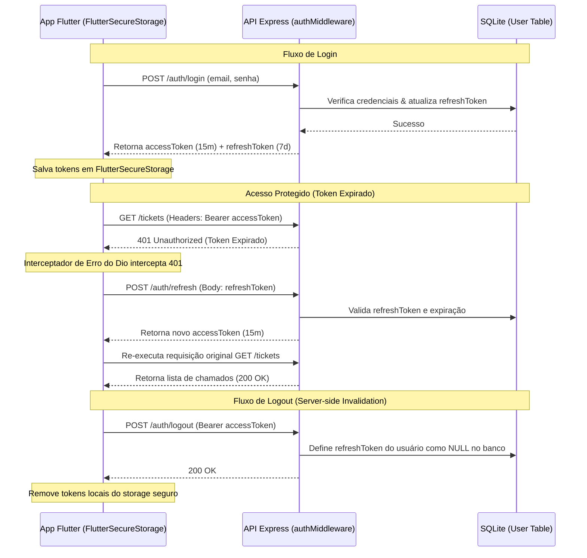
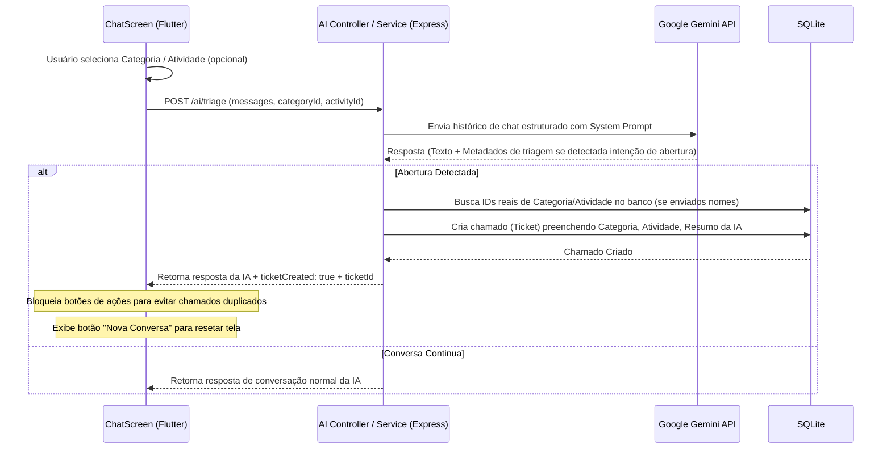

# Arquitetura do Sistema — Chamados Inteligentes

Este documento descreve a arquitetura de camadas, os fluxos de dados fundamentais (Autenticação, Sessão, IA) e os padrões adotados para o projeto **Chamados Inteligentes**.

---

## 1. Visão Geral das Camadas

O projeto adota uma arquitetura em camadas bem definida, separando as responsabilidades de interface, lógica de negócios, acesso a APIs e persistência de dados.

```mermaid
graph TD
    subgraph Frontend (Flutter)
        UI[Telas / UI Widgets] --> Providers[Providers - Estado]
        Providers --> Services[Services - HTTP Clients]
        Services --> Models[Models - Dados]
    end

    subgraph Backend (Node.js + Express)
        Routes[Routes - Roteamento] --> Controllers[Controllers - Requisições]
        Controllers --> BServices[Services - Regra de Negócio]
        BServices --> Repositories[Repositories - Acesso a Dados]
        Repositories --> Prisma[Prisma ORM / SQLite]
    end

    Services -.->|HTTP JSON| Routes
```

### Frontend (Flutter)
- **Telas / Widgets (`lib/screens/`):** Camada de apresentação reativa construída com componentes customizados baseados no `AppTheme` (Design System com Dark Mode e Glassmorphism).
- **Providers (`lib/providers/`):** Gerenciamento de estado centralizado utilizando a biblioteca `provider`. Coordena as operações assíncronas de chamada de serviços e notifica a UI (`notifyListeners()`).
- **Services (`lib/services/`):** Encapsula as chamadas HTTP e conexões REST utilizando a biblioteca `dio`.
- **Models (`lib/models/`):** Definições de entidades tipadas e serializadores JSON (como `TicketModel`, `UserModel`, `CategoryModel`).

### Backend (Node.js / Express)
- **Routes (`src/routes/`):** Roteadores Express que mapeiam endpoints HTTP, aplicam middlewares de autenticação (`authMiddleware`) e de validação de schemas (`validate`).
- **Controllers (`src/controllers/`):** Processam requisições HTTP recebidas, invocam a lógica da camada de serviço e formatam a resposta JSON enviada ao cliente.
- **Services (`src/services/`):** Concentram a lógica de negócio da aplicação (como geração de hash de senhas, criação automática de chamados via IA e controle de expiração de tokens).
- **Repositories (`src/repositories/`):** Camada de abstração de dados que executa queries e manipulações no banco através do Prisma Client.
- **Prisma Client / SQLite (`src/config/database.js`):** Mecanismo de persistência e gerenciamento do esquema de banco de dados SQLite.

---

## 2. Fluxo de Autenticação e Renovação de Sessão (Tokens JWT)

Para prover segurança de nível empresarial, o sistema implementa expiração curta para tokens de acesso, controle por refresh token resiliente no lado do servidor e armazenamento seguro no lado do cliente.



### Pontos Chave:
1. **Configuração de Duração (`.env`):**
   - `JWT_EXPIRES_IN=15m` (Access Token com validade estrita).
   - `JWT_REFRESH_EXPIRES_IN=7d` (Refresh Token persistente de 7 dias).
2. **Armazenamento Seguro:** O aplicativo utiliza `FlutterSecureStorage` no Flutter para persistir os tokens, mitigando vulnerabilidades como Cross-Site Scripting (XSS) e vazamento de sessão.
3. **Invalidamento no Servidor (Logout):** Ao efetuar logout, o `refreshToken` é resetado para `null` no SQLite. Isso garante que sessões revogadas não possam mais ser utilizadas para gerar novos tokens, cumprindo os padrões de segurança.

---

## 3. Triagem de Chamado via Inteligência Artificial (Gemini)

O fluxo do chat inteligente permite triar solicitações automaticamente em tempo real, gerando resumos detalhados e vinculando a categoria e atividades corretas.



### Prevenção de Chamados Duplicados:
1. Enquanto a IA está processando uma mensagem (`isAiTyping == true`), os botões de ação ("Abrir Chamado" e "Resolvido") ficam **ocultos** na UI do frontend.
2. Quando a triagem automática de abertura de chamado é acionada, ou quando o chamado é explicitamente marcado como "Resolvido" ou "Criado", o estado do chat é bloqueado e exibe-se apenas a opção de iniciar uma **"Nova Conversa"**. Isso previne a criação de chamados em lote ou redundantes por cliques rápidos.
3. O frontend envia `categoryId` e `activityId` selecionados na tela de chat para que o backend grave a categorização exata no chamado, impedindo que os chamados criados pela IA fiquem marcados por padrão como categoria "Geral".
